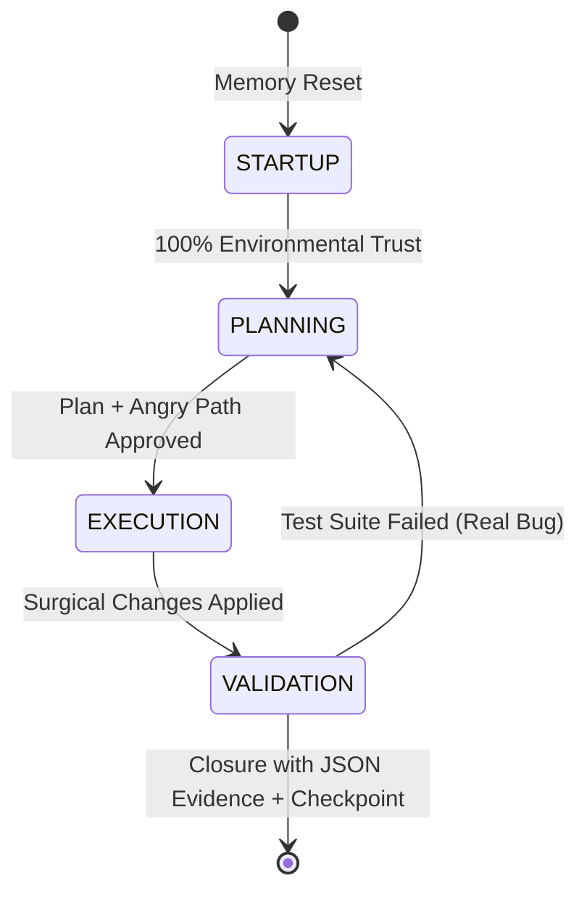

# Appendices — Coding Vices Library

**Source:** `deprecated/BIBLIOTECA_VICIOS_VIBE_CODING.md` (Anexos A-C)

---

## Appendix A: Operator Profile & Semantic Translation

### 1. Conceptual Operator Profile (`[OPERADOR]`)

The system does NOT assume the end user is a low-level technical executor (programmer). The `[OPERADOR]` is formally defined as a **Business Strategist, Risk Auditor, and Complex Decision-Maker (Legal, Financial, Tax)**.

### 2. Translation Interface Directive

Every low-level technical anomaly or transactional failure detected by the Control Plane must undergo immediate semantic transformation in the output layer of the orchestrator:

**Prohibited:** Recurse to the user with raw dependency debug traces (technical slop) as the primary report.

**Mandatory:** Translate the compilation, runtime, or version-parity defect into its consequences of:
- **Operational Risk**
- **Financial Cost of Reversal (Tokenomics Overhead)**
- **Governance Non-Compliance**

#### Example Semantic Translation:

**Raw Technical (Avoid in human channel):**
> `ImportError: No module named 'json' in organizer.py line 45`

**Mandatory Semantic Translation:**
> `BLOCKING STATE in Sanitation Module: Component import error. Consequence: Safe reversal mechanism (Rollback) is inactive. Risk: If we apply changes now, the operation is not reversible. Action: Stop and rebuild precondition.`

---

## Appendix B: 4-Phase Temporal State Machine

To prevent scope drift and logical inconsistency in concurrent sessions, every operational cycle must be governed strictly by a deterministic four-phase state machine with sequential, independent transitions. No phase transition is valid unless its physical exit criterion is met.



### Phase I: STARTUP (Alignment & Ingestion)

**Objective:** Establish absolute environmental trust by purging noise from prior sessions (Amnesia Ritual).

**Mandatory Actions:**
1. Verify physical VCS state (`git status`)
2. Validate protocol version parity via checksums
3. Load canonical functional state registry

**Exit Criterion:** 100% ledger synchronization, zero unintegrated external changes detected, session token budget declared.

### Phase II: PLANNING (Adversarial Design & Angry Path)

**Objective:** Model the causal map of the solution and anticipate all failure scenarios before mutating the system.

**Mandatory Actions:**
1. Trace the *Angry Path* of the change (minimum 3 hostile failure scenarios at data, concurrency, permission boundaries)
2. List all unverified assumptions. If ambiguous hypotheses exceed threshold of 2, system MUST stop
3. Define data schema or interface BEFORE writing logic

**Exit Criterion:** Implementation plan approved by `[OPERADOR]`, explicit surgical design + adversarial assertions defined.

### Phase III: EXECUTION (Surgical Editing)

**Objective:** Apply logical modifications minimizing technical debt delta.

**Mandatory Actions:**
1. Surgical block-by-block editing. Massive rewrites or blind regeneration PROHIBITED
2. Instrument deliberate observability logging in each new transactional function
3. Adhere strictly to the approved plan. ANY deviation or sidequest is BLOCKED

**Exit Criterion:** Edited modules, successful compilation, ready for test oracle injection.

### Phase IV: VALIDATION (Empirical Oracle & Evidence)

**Objective:** Indisputably verify business logic correctness via black-box evidence.

**Mandatory Actions:**
1. Execute test discovery audit (engine-discovered vs. physical inventory on disk)
2. Actively test adversarial boundary limits defined in *Angry Path*
3. Generate and persist structured evidence records in serializable format (JSON) with timestamps and physical deltas

**Exit Criterion:** 100% suite executed and approved (APPROVED), physical evidence persisted in local ledger, work session closed with checkpoint update.

---

## Appendix C: Escalation & Interruption Matrix

Flow control for incidents, anomalies, or unexpected findings is governed by the following algorithmic decision tree, prioritizing system stability over delivery speed:

```
[Incident Start / Deviation Discovery]
                |
                v
    Is it a blocker that breaks the main task
    or breaks a physical contract?
              / \
             /   \
       (YES)/     \(NO - Secondary finding / optimization)
           v       v
   [Route A: Critical Block]    [Route B: Passive Registry]
           |                            |
           v                            v
     1. Stop execution.          1. Continue with active Plan.
     2. Change state to BLOCKED. 2. Divert finding to external
     3. Revert to last checkpoint  persistent backlogs (VCS).
     4. Return to PHASE II.       3. Record in change audit
     5. Present semantic             (HISTORIAL).
        diagnosis to Operador.   4. PROHIBIT code modifications
                                    outside scope.
```

### Interruption Matrix Rules

**Golden Rule of Blocking:** Regression defects, credential leaks, or critical syntax errors in production have **infinite resolution priority**. They block the pipeline immediately and demand replanning.

**Golden Rule of Drift:** Strictly prohibited: initiating refactorings or convenience patches for secondary failures interactively during the current execution cycle. Any "nice-to-have" must be ignored and registered in the external backlog ledger to prevent context window saturation and devaluation.

---

## Legacy Reference

Original document: `D:\AI\Cerberus\deprecated\Golden_Standard\BIBLIOTECA_VICIOS_VIBE_CODING.md`

These appendices are extracted verbatim for integration. See DEDUP_LOG.yaml for consolidation rationale.
