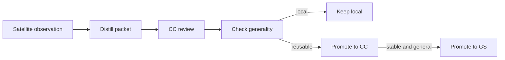

# Satellite Learning Flow

This document defines how a satellite turns local observations into reusable
knowledge.

## Rule

Local work produces evidence. CC normalizes it. GS only receives patterns that
are stable and broadly reusable.

## Scopes

- `local`: keep it in the satellite.
- `cc`: promote it because more than one satellite can use it.
- `gs`: promote it because it is stable, general, and not project-specific.

## Packet

Each learning packet must include:

- source repo
- category
- summary
- root cause
- fix
- evidence
- scope
- recommendation
- impact

## Flow

## Promotion

- Keep local when the fix is repo-specific or incomplete.
- Promote to CC when the pattern repeats across satellites.
- Promote to GS when the rule is stable and reusable without extra noise.

## Learnable signals

1. Vices and failure patterns.
2. Test consolidation opportunities.
3. Token-saving strategies.
4. Documentation and navigation improvements.
5. Better guards for code, docs, and tests.

## Canonical artifacts

- `docs/learning/LEARNING_EVENT_SCHEMA.json`
- `docs/learning/LEARNING_EVENT_TEMPLATE.json`
- `learnings/`
- `project_insights/`
