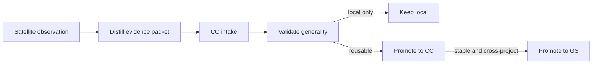

# Satellite Learning Flow

This document defines how knowledge moves from a satellite to CC and, only
when stable, to GS.

## Core idea

Local work produces observations. CC filters, normalizes, and validates those
observations. GS only receives stable patterns that have proven useful beyond a
single repo.

## Learning scopes

- **local**: keep the learning in the satellite only.
- **cc**: promote the learning to CC because it is reusable across satellites.
- **gs**: promote the learning to GS because it is stable and general enough.

## What can be learned

1. Vices and failure patterns.
2. Test consolidation opportunities.
3. Token-saving strategies.
4. Documentation and navigation improvements.
5. Better guards for code, docs, and tests.

## Learning packet requirements

Each packet must include:

- source repo
- category
- summary
- root cause
- fix
- evidence
- scope
- recommendation
- impact

## Flow

## Promotion rules

### Keep local

- The fix only works in this repo.
- The pattern is too tied to the current implementation.
- The evidence is incomplete.

### Promote to CC

- The pattern appears in more than one satellite.
- The improvement reduces maintenance or token cost.
- The fix is repeatable and can be expressed as a rule or checklist.

### Promote to GS

- The pattern is stable.
- The evidence is strong.
- The rule is broadly reusable.
- The change does not add project-specific noise.

## Canonical artifacts

- `docs/learning/LEARNING_EVENT_SCHEMA.json`
- `docs/learning/LEARNING_EVENT_TEMPLATE.json`
- `learnings/`
- `project_insights/`

